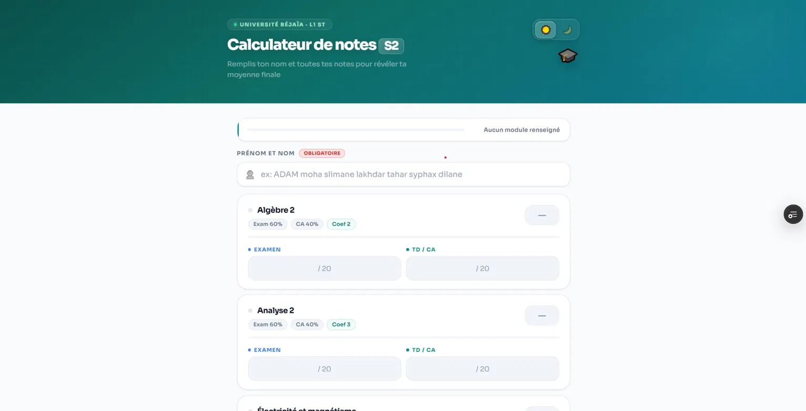
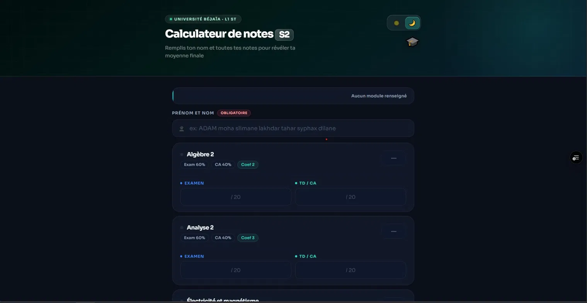
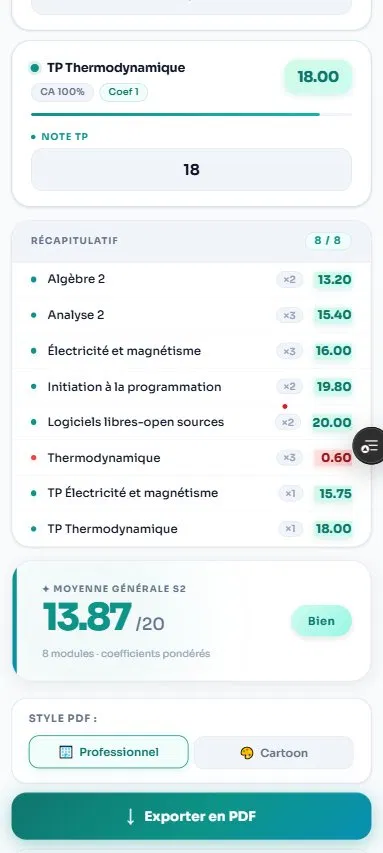

<div align="center">

# 🎓 S2 Grade Calculator

**Semester 2 grade calculator for L1 Computer Science (LMD) students**

Compute your weighted average, get your mention instantly, and export a clean PDF transcript.

[](https://s2-grade-calc.vercel.app)
[](LICENSE)


</div>

---

## 📸 Screenshots

### 🖥️ Desktop Version

| Light Mode | Dark Mode |
|------------|-----------|
|  |  |

### 📱 Mobile Version

| Calculator | Results |
|------------|---------|
|  |  |

> Create a `screenshots/` folder in the repository and add the images with the names above.


## ✨ Features

- **📊 Smart grade calculation** — enter your Exam and CA (contrôle continu) marks; each module's final note is computed using its official weighting (60% exam / 40% CA, TP modules 100% CA) and coefficient
- **🏆 Instant mention** — Excellent, Très Bien, Bien, Passable, or Insuffisant, color-coded as you type
- **📄 PDF export** — generate a polished grade report with multiple templates (powered by jsPDF + AutoTable)
- **💾 Auto-save** — completed calculations are stored automatically in the browser
- **🛠️ Admin dashboard** — protected admin area with saved-results overview, statistics charts (Recharts), and per-student detail view
- **🌙 Dark mode** — theme preference persisted across sessions
- **✅ Input validation** — grades clamped to the 0–20 range, progress indicator until all modules are filled

## 📚 Modules covered

| Module | Coef | Exam | CA |
|---|:-:|:-:|:-:|
| Analyse 2 | 3 | 60% | 40% |
| Électricité et magnétisme | 3 | 60% | 40% |
| Thermodynamique | 3 | 60% | 40% |
| Algèbre 2 | 2 | 60% | 40% |
| Initiation à la programmation | 2 | 60% | 40% |
| Logiciels libres / open source | 2 | 60% | 40% |
| TP Électricité et magnétisme | 1 | — | 100% |
| TP Thermodynamique | 1 | — | 100% |

The overall average is the coefficient-weighted mean of all module notes.

## 🚀 Getting started

### Prerequisites
- [Node.js](https://nodejs.org/) 18+
- npm (bundled with Node)

### Installation

```bash
# Clone the repository
git clone https://github.com/linuxcoding-ADAM/S2_Grade_Calc.git
cd S2_Grade_Calc

# Install dependencies
npm install

# Start the dev server
npm run dev
```

Open the URL printed by Vite (usually `http://localhost:5173`).

### Production build

```bash
npm run build     # builds to dist/
npm run preview   # preview the production build locally
```

## 🗂️ Project structure

```
S2_Grade_Calc/
├── index.html
├── vite.config.js
├── vercel.json            # Vercel deployment config
└── src/
    ├── main.jsx           # Entry point & routing
    ├── App.jsx            # Main calculator UI & logic
    ├── pdfExport.js       # PDF report generation (templates)
    ├── db/
    │   └── storage.js     # Local persistence layer
    └── admin/
        ├── AdminLogin.jsx
        ├── AdminDashboard.jsx   # Stats & charts
        └── AdminDetail.jsx      # Per-record detail view
```

## 🧰 Tech stack

- **[React 18](https://react.dev/)** — UI
- **[Vite 5](https://vitejs.dev/)** — build tool & dev server
- **[React Router 7](https://reactrouter.com/)** — routing (calculator / admin)
- **[jsPDF](https://github.com/parallax/jsPDF)** + **[jspdf-autotable](https://github.com/simonbengtsson/jsPDF-AutoTable)** — PDF export
- **[Recharts](https://recharts.org/)** — admin statistics charts
- **[Vercel](https://vercel.com/)** — hosting

## 🤝 Contributing

Contributions are welcome! Feel free to open an issue or submit a pull request.

1. Fork the project
2. Create your feature branch (`git checkout -b feature/my-feature`)
3. Commit your changes (`git commit -m 'Add my feature'`)
4. Push to the branch (`git push origin feature/my-feature`)
5. Open a Pull Request

## 📝 License

This project is licensed under the **MIT License** — see the [LICENSE](LICENSE) file for details.

---

<div align="center">
Made with ❤️ by <a href="https://github.com/linuxcoding-ADAM">linuxcoding-ADAM</a>
</div>
